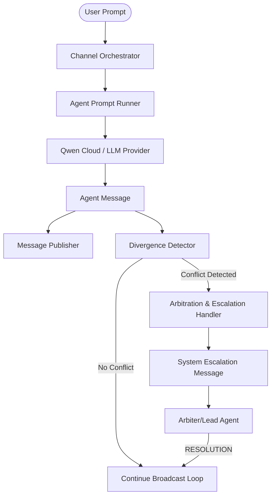

# Deliberative Protocol — Multi-Agent Arbitration Architecture

This document details the multi-agent collaboration, conflict resolution, and arbitration engine of CrewFactory. It explains how agents collaborate, detect architectural disagreements, negotiate, and how a designated leader resolves deadlocks.

---

## 1. Core Architecture

The system utilizes a structured, event-driven multi-agent orchestration pattern that coordinates sequential debates in collaborative, adversarial, or arbitrated modes.

---

## 2. Divergence Detector

The `DivergenceDetector` is a stateless utility that analyzes conversation messages to identify conflict signals in real time. It parses three types of events:

1. **Score Delta Divergence**: If two agents evaluate a specific topic (e.g. latency, cost, stack) and their ratings differ by $\ge 2$ points on a 10-point scale:
   - Format: `SCORE: [topic] = X/10` (or compatible fuzzy formats).
   - If $|Score_A - Score_B| \ge 2$, it flags a `score_delta` divergence event.
2. **Explicit Objections**: Triggered when an agent outputs the keyword `OBJECTION: <reason>`.
3. **Compliance Vetoes**: Triggered when an agent outputs the keyword `VETO: <reason>`.

---

## 3. Protocol Transitions & Arbitration

When a divergence or veto is detected, the loop triggers the **Arbitration Protocol**:

1. **Conversation Freeze**: The normal sequential round-robin broadcast loop is frozen.
2. **System Escalation**: A system-level message is published to the channel to notify all participants and the frontend:
   - Content: `[DIVERGENCIA DETECTADA] <divergence reason>. @Arbiter, emite una resolución formal vinculante para resolver este bloqueo.`
3. **Arbitrator Turn Execution**: The designated arbitrator (Lead Agent) is immediately scheduled and executed.
4. **Veredict & Resume**: The arbitrator is instructed to evaluate both positions and output a binding veredicto using the strict format:
   - `RESOLUTION: <final decision> | REASONING: <why> | OVERRULED: <overruled position and why>`
5. **Arbitration Timeout & Contingency Fallback**: If arbitration exceeds 3 cycles without reaching consensus, the orchestrator executes a safety-first contingency fallback, resolving the conflict with standard regulatory compliance parameters to prevent deadlocks.
6. **Agreement Resolution**: The keyword `RESOLUTION:` matches the negotiation's `agreementPattern`, changing the state to `agreed` and successfully completing the pipeline.

---

## 4. Measurable Efficiency Metrics

CrewFactory tracks and compares the execution logs of three variants (Baseline, Horizontal, Hierarchical) to calculate:

- **Debate Activation Rate**: The percentage of agent turns where a divergence was detected and arbitration was activated.
- **Divergence Count**: Total number of unique conflicts identified.
- **Arbitration Rounds**: Total number of binding decisions made.
- **Resource Efficiency**: Ratio of quality score improvement compared to token consumption overhead relative to the single-agent baseline.
