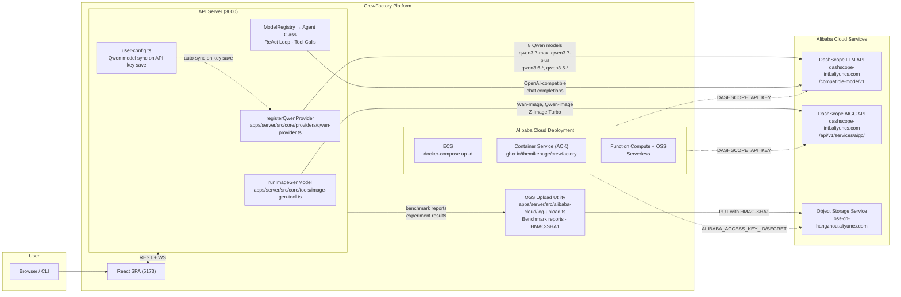
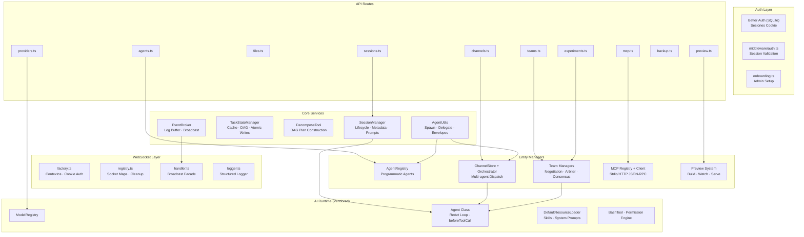

# CrewFactory Architecture

## Qwen Cloud Integration

## Server Internals

## Key Qwen Cloud Models

| Model | Context | Thinking | Vision | Use Case |
|-------|---------|----------|--------|----------|
| qwen3.7-max | 128k | Yes | Yes | Complex reasoning, orchestration agents |
| qwen3.7-plus | 128k | Yes | No | Balanced performance/cost |
| qwen3.6-max-preview | 128k | Yes | Yes | Preview cutting-edge |
| qwen3.6-plus | 128k | Yes | No | Standard agent tasks |
| qwen3.6-flash | 128k | Yes | No | High-throughput, low-latency |
| qwen3.5-plus | 128k | Yes | No | Legacy stable |
| qwen3.5-flash | 128k | Yes | No | Fast inference |
| wan2.7-image-pro | — | — | — | Image generation (AIGC) |
| qwen-image-2.0-pro | — | — | — | Image generation (AIGC) |
| z-image-turbo | — | — | — | Fast image generation (AIGC) |

## Key Architectural Decisions

| Decision | Choice | Rationale |
|----------|--------|-----------|
| LLM Provider | Qwen Cloud DashScope API (OpenAI-compatible) | Direct integration, no proxy, full Qwen model family |
| Image Gen | DashScope AIGC API with multi-endpoint fallback | Wan-Image, Qwen-Image, Z-Image Turbo; retries intl + cn endpoints |
| API Key Mgmt | Dynamic provider config via web UI | No env vars needed; auto-syncs models on key save |
| State Management | URL as source of truth + localStorage convenience | No cache invalidation, idempotent transitions, survives refresh |
| Real-Time | Singleton WebSocket + exponential backoff + offline queue | Prevents 3x connection overhead, handles network flakiness |
| Auth | httpOnly cookie-based (Better Auth) | No JS-accessible tokens, sync DB fallback for programmatic tokens |
| AI Runtime | Vendored Agent class in-process | Zero network overhead for agent loops, direct beforeToolCall hooks |
| Persistence | Filesystem-first + SQLite only for auth | Simple backup (zip), no DB migrations, easy inspection |
| Preview | Isolated port 3001 Bun.serve | No SPA/auth in preview URLs, framework-agnostic |
| MCP | Stdio/HTTP subprocess lifecycle | Workspace sandboxing via $WORKSPACE_DIR replacement |
| Multi-Agent | 4 composeable primitives (Spawn, Delegate, Negotiate, Arbitrate) | Replaces 7 legacy pathways with uniform protocol |

## Layer Responsibilities

| Layer | Key Modules | Responsibility |
|-------|-------------|----------------|
| WebSocket | factory.ts, registry.ts, handler.ts | Real-time bidirectional streaming with cookie auth, session/channel subscriptions |
| Auth | Better Auth, middleware/auth.ts | Cookie-based session management, first-run onboarding, programmatic tokens |
| Core | SessionManager, TaskStateManager, EventBroker | Agent lifecycle orchestration, task DAGs, log broadcasting |
| Entities | AgentRegistry, ChannelOrchestrator, Team managers, MCP | Entity-specific lifecycle, multi-agent dispatch, tool integration |
| AI Runtime | Vendored Agent class, ModelRegistry | ReAct loops, prompt composition, skill injection, permission hooks |
| Client | React Context, wsClient singleton, AG-UI components | State derived from URL, singleton WS connection, generative UI pipeline |

## Deployment on Alibaba Cloud

| Service | Method | Details |
|---------|--------|---------|
| ECS | `docker compose up -d` | Full control, persistent storage bind-mounts |
| ACK (K8s) | `ghcr.io/themikehage/crewfactory:latest` | Auto-scaling, service mesh |
| Function Compute | Serverless + OSS for state | Pay-per-invocation, stateless |
| OSS | `log-upload.ts` | HMAC-SHA1 signed PUTs, no SDK deps |
