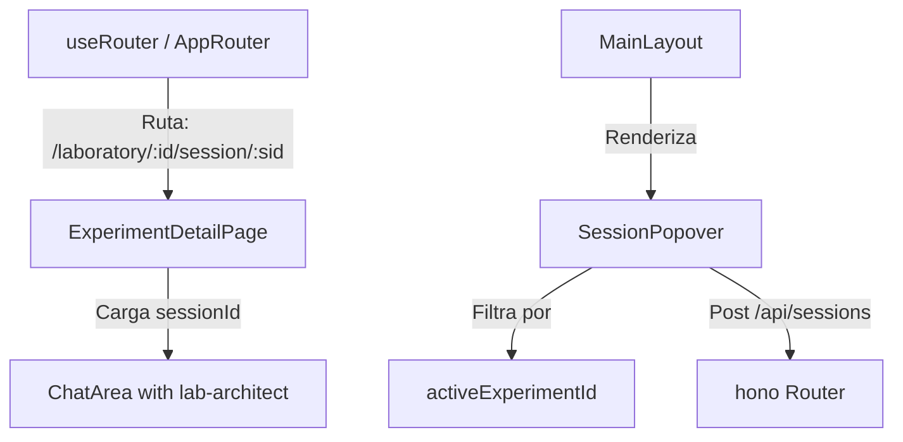

# Laboratory Sessions Plan

Este plan detalla los cambios necesarios para añadir soporte de sesiones en el Laboratorio de CrewFactory. Esto permitirá a los usuarios tener múltiples sesiones de chat con el agente `lab-architect` por cada experimento, tal como ya se hace con Proyectos, Agentes y Canales.

## Objetivos
1. Permitir que cada experimento del laboratorio tenga múltiples sesiones de diseño/chat.
2. Añadir los botones "Nueva Sesión" (+) y "Sesiones" en la barra superior cuando se esté visualizando un experimento.
3. Mostrar el historial de sesiones del experimento a través del componente común `SessionPopover`.
4. Soporte para URL enrutables del tipo `/laboratory/:experimentId/session/:sessionId`.
5. Al alternar o crear una sesión, redirigir automáticamente a la pestaña de "Chat" del experimento.

## Arquitectura de la Solución

## Cambios Propuestos

### Cliente (Frontend)

1. **`apps/client/src/hooks/useRouter.ts`**
   - Extender el tipo `Route` para admitir `sessionId` opcional en la página de laboratorio: `{ page: "laboratory"; experimentId?: string | null; sessionId?: string | null }`.
   - Modificar la función `parseRoute` para detectar rutas con el formato `/laboratory/:experimentId/session/:sessionId`.

2. **`apps/client/src/components/layout/AppRouter.tsx`**
   - Extraer `sessionId` cuando la página es `laboratory`.
   - Pasar `sessionId` y la función `navigate` (`onNavigate`) como propiedades al componente `ExperimentDetailPage`.

3. **`apps/client/src/components/layout/MainLayout.tsx`**
   - Actualizar `getSessionPath` para generar la ruta correcta de sesiones de laboratorio: `/laboratory/${selectedExpId}/session/${id}`.
   - En `handleSelectSession`, cambiar la pestaña activa de variante (`activeVariantTab`) a `"chat"` cuando se navegue dentro del laboratorio.
   - Refactorizar las secciones de cabecera (escritorio y móvil) para mostrar el botón de crear sesión (+) y el botón de abrir historial de sesiones cuando un experimento esté seleccionado.
   - Mover el componente `SessionPopover` fuera de la condicional y pasarle `activeExperimentId` y `activeProjectFriendlyName` adaptados al experimento.

4. **`apps/client/src/pages/ExperimentDetailPage.tsx`**
   - Recibir las propiedades `sessionId` y `onNavigate`.
   - Modificar el efecto de inicialización de la sesión:
     - Si `sessionId` viene en las propiedades, utilizarlo directamente como sesión activa.
     - Si no viene, buscar la sesión más reciente del experimento o crear una nueva si no existe, y redirigir a `/laboratory/:experimentId/session/:resolvedSessionId`.

5. **`apps/client/src/components/sidebar/SessionPopover.tsx` & `.literals.ts`**
   - Añadir soporte para la propiedad `activeExperimentId`.
   - Filtrar la lista de sesiones usando `experimentId === activeExperimentId`.
   - Ajustar el payload de creación en `createSession` para incluir `experimentId` y forzar `agentId: "lab-architect"`.
   - Traducir literales y evitar hardcoding.
